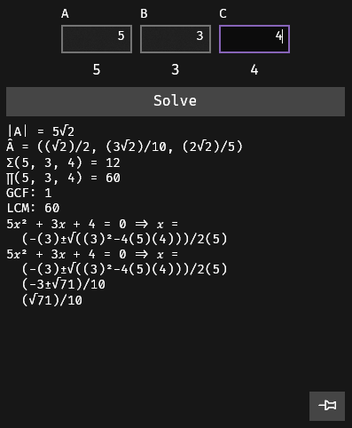

# Features

## Notes

A space for quickly typing equations with unicode math symbols and automatic alignment.

### Shortcuts

<table>
  <thead>
  <tr>
    <th>Input</th>
    <th>Action</th>
    <th>Example Input</th>
    <th>Example Output</th>
  </tr>
  </thead>
  <tbody>
  <tr>
    <td><kbd>Alt</kbd> + <kbd>Enter</kbd></td>
    <td colspan=3>Toggle calculator pane</td>
  </tr>
  <tr>
    <td><kbd>Ctrl</kbd> + <kbd>Alt</kbd> + <kbd>left</kbd></td>
    <td colspan=3>Jump left one column</td>
  </tr>
  <tr>
    <td><kbd>Ctrl</kbd> + <kbd>Alt</kbd> + <kbd>right</kbd></td>
    <td colspan=3>Jump right one column</td>
  </tr>
  <tr>
    <td><kbd>Shift</kbd> + <kbd>Enter</kbd></td>
    <td colspan=3>Duplicate line down</td>
  </tr>
  <tr>
    <td><kbd>Alt</kbd> + <kbd>Shift</kbd> + <kbd>down</kbd></td>
    <td colspan=3>Duplicate line down</td>
  </tr>
  <tr>
    <td><kbd>Alt</kbd> + <kbd>Shift</kbd> + <kbd>up</kbd></td>
    <td colspan=3> Duplicate line up</td>
  </tr>
  <tr>
    <td><kbd>Ctrl</kbd> + (<kbd>1</kbd> or <kbd>2</kbd> or <kbd>3</kbd>)</td>
    <td colspan=3>Insert selection into the corresponding calculator input</td>
  </tr>
  <tr>
    <td><kbd>Ctrl</kbd> + <kbd>Enter</kbd></td>
    <td colspan=3>Clear calculator inputs and replace 1st with selection</td>
  </tr>
  <tr>
    <td><kbd>Ctrl</kbd> + <kbd>space</kbd></td>
    <td>Calculate approximate value of the selection inline</td>
    <td>
      <mark>8(4 + 3)</mark> 
      <kbd>Ctrl</kbd> + <kbd>space</kbd>
    </td>
    <td>8(4 + 3) = 56</td>
  </tr>
  <tr>
    <td rowspan=5><code>\&lt;command&gt;\</code></td>
    <td rowspan=5>

Unicode equivalent of the corresponding <code>&lt;command&gt;</code> $\LaTeX$ command

</td>
      <td><code>\forall\</code></td><td>&forall;</td></tr>
  <tr><td><code>\exists\</code></td><td>&exist;</td></tr>
  <tr><td><code>\in\</code></td><td>&in;</td></tr>
  <tr><td><code>\Omega\</code></td><td>&Omega;</td></tr>
  <tr><td><code>\boxonbox\</code></td><td>⧉</td></tr>
  <tr>
    <td><code>\matrix&lt;rows&gt;x&lt;cols&gt;</code></td>
    <td>Create a matrix with <code>&lt;rows&gt;</code> rows and <code>&lt;cols&gt;</code> columns (between 1 and 9)</td>
    <td><code>\matrix3x2</code></td>
    <td><pre>
⎡& ... && ... &⎤
⎢& ... && ... &⎥
⎣& ... && ... &⎦
</pre>
    </td>
  </tr>
  <tr>
    <td><code>\det​&lt;rows&gt;x&lt;cols&gt;</code></td>
    <td>Create a determinant with <code>&lt;rows&gt;</code> rows and <code>&lt;cols&gt;</code> columns (between 1 and 9)</td>
    <td><code>\det​3x2</code></td>
    <td><pre>
⎢& ... && ... &⎥
⎢& ... && ... &⎥
⎢& ... && ... &⎥
</pre>
    </td>
  </tr>
  <tr>
    <td><code>\cases&lt;cases&gt;</code></td>
    <td>Create a piecewise with <code>&lt;cases&gt;</code> cases (between 1 and 9)</td>
    <td><code>\cases3</code></td>
    <td><pre>
⎧ & ... & if ...
⎨ & ... & if ...
⎩ & ... & if ...
</pre>
    </td>
  </tr>
  <tr>
    <td><code>\rcases&lt;cases&gt;</code></td>
    <td>Create a reverse piecewise with <code>&lt;cases&gt;</code> cases (between 1 and 9)</td>
    <td><code>\rcases3</code></td>
    <td><pre>
& ... & if ... & ⎫
& ... & if ... & ⎬
& ... & if ... & ⎭
</pre>
    </td>
  </tr>
  <tr>
    <td rowspan=4>
        <code>^&lt;...&gt;</code> 
        or 
        <code>^{&lt;...&gt;}</code>
    </td>
    <td rowspan=4>Superscript <code>&lt;...&gt;</code></td>
      <td><code>^0-^9</code></td><td>⁰-⁹</td></tr>
  <tr><td><code>1^23</code></td><td>1²3</td></tr>
  <tr><td><code>^{0-9}</code></td><td>⁰⁻⁹</td></tr>
  <tr><td><code>1^{23}</code></td><td>1²³</td></tr>
  <tr>
    <td rowspan=4>
        <code>_&lt;...&gt;</code> 
        or 
        <code>_{&lt;...&gt;}</code>
    </td>
    <td rowspan=4>Subscript <code>&lt;...&gt;</code></td>
        <td><code>_0-_9</code></td><td>₀-₉</td></tr>
    <tr><td><code>1_23</code></td><td>1₂3</td></tr>
    <tr><td><code>_{0-_9}</code></td><td>₀₋₉</td></tr>
    <tr><td><code>1_{23}</code></td><td>1₂₃</td></tr>
  <tr>
    <td rowspan=3><code>$&lt;...&gt;</code></td>
    <td rowspan=3>Blackboard bold <code>&lt;...&gt;</code></td>
        <td><code>$A-$Z</code></td><td>&Aopf;-&Zopf;</td></tr>
    <tr><td><code>$a-$z</code></td><td>&aopf;-&zopf;</td></tr>
    <tr><td><code>$0-$9</code></td><td>𝟘-𝟡</td></tr>
  <tr>
    <td rowspan=2><code>\&lt;...&gt;\</code></td>
    <td rowspan=2>Math variable <code>&lt;...&gt;</code></td>
        <td><code>\A\-\Z\</code></td><td>𝐴-𝑍</td></tr>
    <tr><td><code>\a\-\z\</code></td><td>𝑎-𝑧</td></tr>
  <tr><td><code>@@</code></td><td colspan=2>Circ</td><td>∘</td></tr>
  <tr><td><code>@0</code></td><td colspan=2>Degrees</td><td>°</td></tr>
  <tr><td><code>@*</code></td><td colspan=2>Times</td><td>×</td></tr>
  <tr><td><code>@.</code></td><td colspan=2>Cdot</td><td>⋅</td></tr>
  <tr><td><code>@/</code></td><td colspan=2>Div</td><td>÷</td></tr>
  <tr><td><code>@-</code></td><td colspan=2>Intersection</td><td>⋂</td></tr>
  <tr><td><code>@+</code></td><td colspan=2>Union</td><td>⋃</td></tr>
  <tr><td><code>@2</code></td><td colspan=2>Square root</td><td>√</td></tr>
  <tr><td><code>√³</code></td><td colspan=2>Cube root</td><td>∛</td></tr>
  <tr><td><code>√⁴</code></td><td colspan=2>Cube root</td><td>∜</td></tr>
  <tr><td><code>@8</code></td><td colspan=2>Infinity</td><td>∞</td></tr>
  <tr><td><code>@6</code></td><td colspan=2>Partial derivative</td><td>∂</td></tr>
  <tr><td><code>@A</code></td><td colspan=2>Forall</td><td>∀</td></tr>
  <tr><td><code>@E</code></td><td colspan=2>Exists</td><td>∃</td></tr>
  <tr><td><code>@v0</code></td><td colspan=2>Varnothing</td><td>∅</td></tr>
  <tr><td><code>@I</code></td><td colspan=2>Integral</td><td>∫</td></tr>
  <tr><td><code>\&</code></td><td colspan=2>Non-aligning ampersand</td><td>＆</td></tr>
  </tbody>
</table>

### Brackets

`()`, `[]`, and `{}` are created in pairs and surround the selection.\
If the brackets are empty, backspacing the opening bracket deletes the closing bracket.\
`)`, `]`, and `}` can overtype each other (to make interval notation easier).

### Align

Use `&` to separate columns.\
Columns are aligned in an alternating pattern of right, left, right, left, etc.
<pre>
&longrightarrow; & &longleftarrow; & &longrightarrow; & &longleftarrow;
</pre>

Use `&&` to keep the same alignment direction in the new column.
<pre>
&longrightarrow; && &longrightarrow; && &longrightarrow; && &longrightarrow; & &longleftarrow; && &longleftarrow; && &longleftarrow; && &longleftarrow;
</pre>

Alignments are localized to the current "chunk". Chunks are separated by lines that have no `&`s.
<table>
  <tr>
    <th>Input</th>
    <th>Analysis</th>
    <th>Output</th>
  </tr>
  <tr>
    <td>
<pre>
apple & banana & orange & mango
000 & 000 & 000 & 000
blah blah blah blah
0000 & 0000 && 0000
0 & 0 && 0
</pre>
    </td><td>
<pre>
----------- chunk 1 -----------
apple & banana & orange & mango
  000 & 000    &    000 & 000
      ^        ^        ^
----------- chunk 2 -----------
blah blah blah blah 
----------- chunk 3 -----------
0000 & 0000 && 0000
   0 & 0    && 0
     ^      ^^
-------------------------------
</pre>
    </td><td>
<pre>
apple & banana & orange & mango
  000 & 000    &    000 & 000
blah blah blah blah
0000 & 0000 && 0000
   0 & 0    && 0
</pre>
      </td>
    </tr>
</table>

**Note:** Alignment is performed using spaces in a monospace font&mdash;not by repositioning characters. Alignment may fail for text containing unicode characters skinnier or wider than the monospace width.

## Calculator

Provides information about numbers and calculates exact values. Capable of simplifying radicals & fractions and performing prime factorization.

  

### Shortcuts

- Press enter to calculate.

## Symbol lookup

Search for unicode symbols by name.

### Shortcuts

- Press enter to search.
- Press escape to clear the search.
- Click a symbol to insert it in the notes section.
